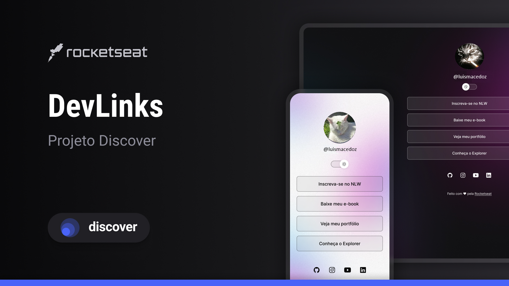

<h1 align="center"> DevLinks </h1>

Programa exclusivo pra informações sobre mim, auxiliado pela RocketSeat.

  <a href="#-tecnologias">Tecnologias</a>&nbsp;&nbsp;&nbsp;|&nbsp;&nbsp;&nbsp;
  <a href="#-projeto">Projeto</a>&nbsp;&nbsp;&nbsp;|&nbsp;&nbsp;&nbsp;
  <a href="#-layout">Layout</a>&nbsp;&nbsp;&nbsp;|&nbsp;&nbsp;&nbsp;
  <a href="#memo-licença">Licença</a>

  

 

  

## 🚀 Tecnologias

Esse projeto foi desenvolvido com as seguintes tecnologias:

- HTML e CSS
- JavaScript
- Git e Github
- Figma

## 💻 Projeto

O DevLinks é um projeto produzido a fins informativos, muito usado pra cartão de visitas ou portfólio na maioria das vezes.

## 🔖 Layout

Você pode visualizar o layout do projeto através [DESSE LINK](<https://www.figma.com/file/MF894TdzM99Fg9Ssu4KyMq/DevLinks-(Copy)?node-id=1%3A113&t=8x94o7ecTaQMC2CS-1/duplicate>). É necessário ter conta no [Figma](https://figma.com) para acessá-lo.

## :memo: Licença

Esse projeto está sob a licença MIT.

---

Feito por @maikybrito e modificado por @luismacedoz (auxiliado pela RocketSeat) (Descrição alterada!) :wave: